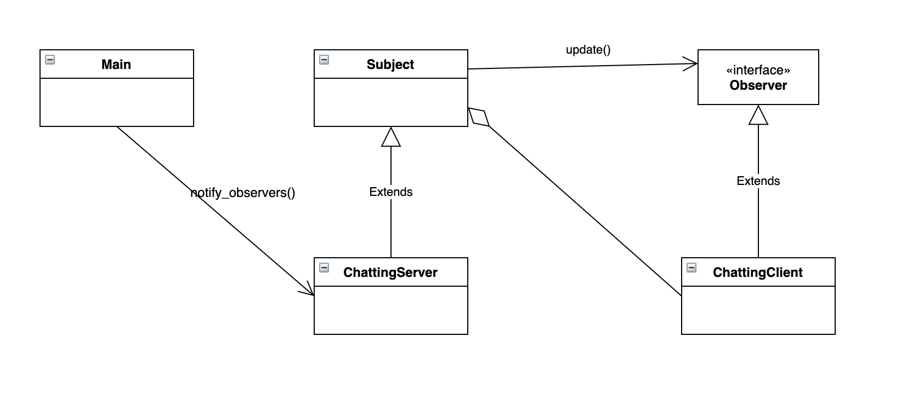
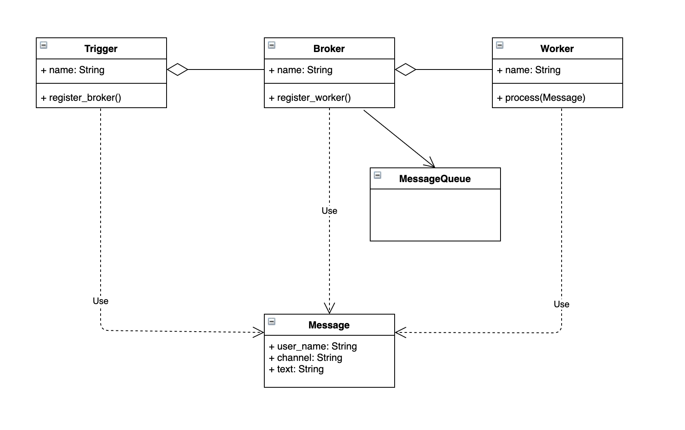

# event_driven_chatting
- The purpose of this project is to implement chatting server-client based on event-driven architecture
- 채팅 프로그램을 구현하기 위해서 공부한 내용들을 정리하기 위한 저장소

# 옵저버 패턴 (Observer Pattern)
## 개념 이해

## 구현 클래스 관점

- 채팅 프로그램은 특성상 N개의 클라이언트로부터 메시지를 받아서 다시 N개의 클라이언트에게 메시지를 전달하는 구조
- 옵저버 패턴 또한 서버(Subject)를 바라보는 N개의 클라이언트(Observer)에게 정보를 전달하는 방식

# 이벤트-드리븐 패턴(EventDriven Pattern)
## 개념 이해

## 구현 클래스 관점

- 이벤트를 촉발하는 주체와 처리하는 주체가 각각 비동기적으로 업무를 수행하는 방식
- 이벤트를 촉발하는 주체와 처리하는 주체 사이에 이벤트 큐(이벤트 버스, 메시지 큐 등)를 두어서 둘 사이의 결합도를 낮추는 방

# 네트워크 통신을 통한 이벤트-드리븐 패턴
## 개념 이해
